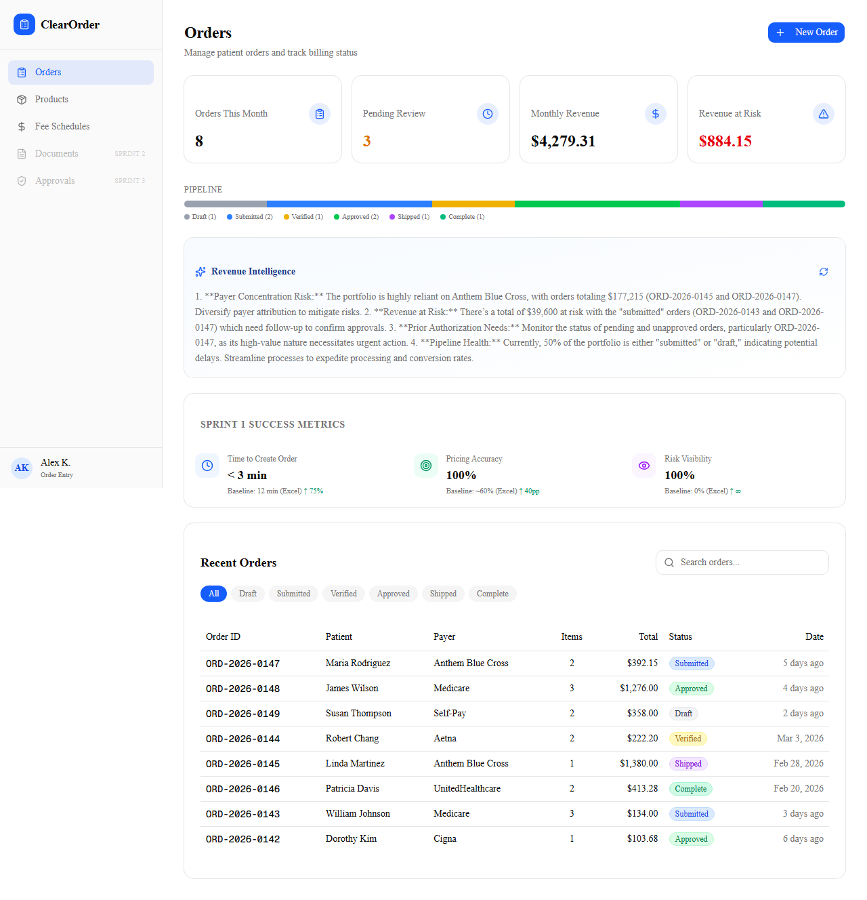
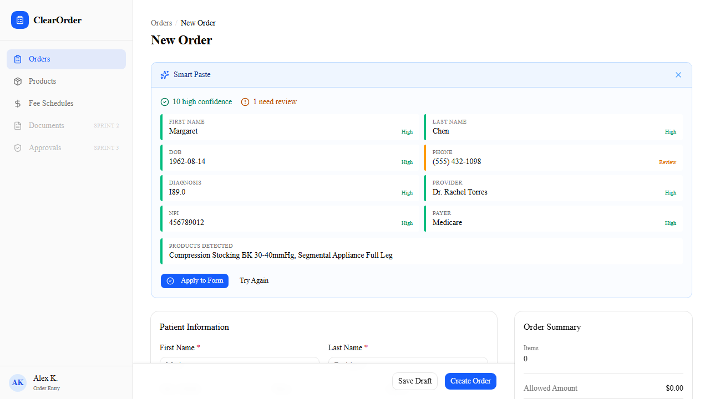
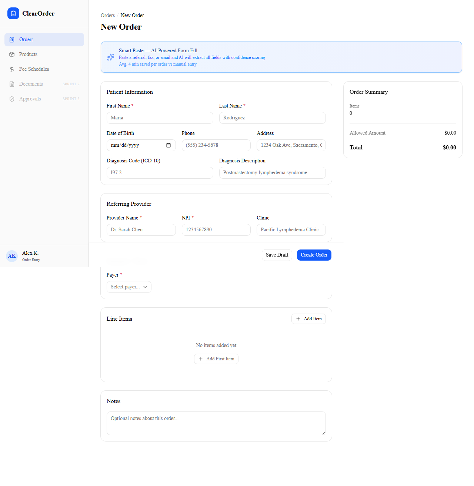
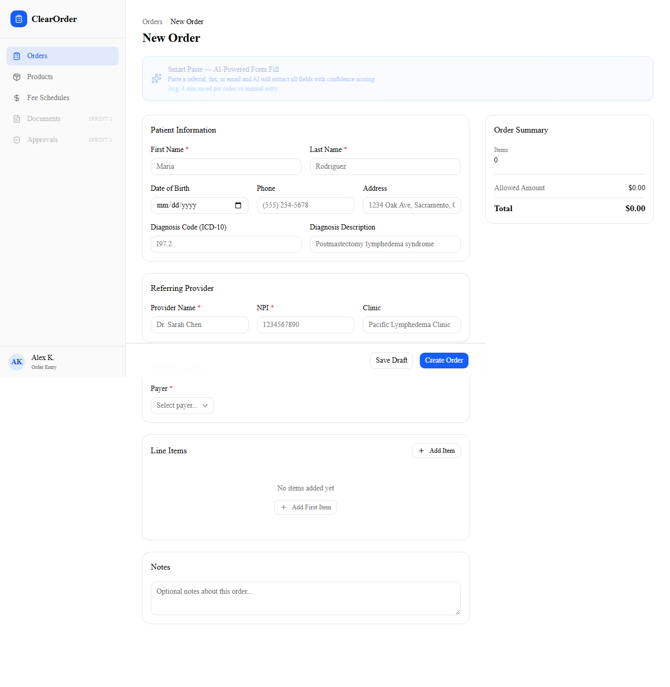
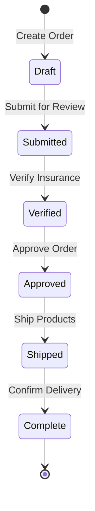
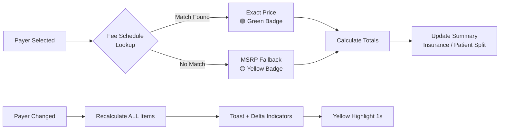

# ClearOrder — Sprint 1 Prototype

**Medical supply order management that replaces Excel with automated pricing, AI-assisted data entry, and claim risk visibility.**

Live: [clearorder.vercel.app](https://clearorder.vercel.app) (Vercel)

---

## Quick Start

```bash
npm install
npm run dev          # localhost:3000
npm run build        # production build
npx vercel --yes --prod  # deploy
```

Environment: Set `OPENAI_API_KEY` in Vercel dashboard for AI features. All features degrade gracefully without it (hardcoded fallbacks).

---

## Architecture

```
Next.js 16 + TypeScript (strict) + Tailwind v4 + shadcn/ui + framer-motion 12
├── App Router, all client components ("use client")
├── Hardcoded seed data in lib/data.ts (no backend — intentional for Sprint 1)
├── localStorage persistence via React Context + useReducer
├── 3 AI API routes (Vercel AI SDK + OpenAI gpt-4o-mini)
└── Desktop-first (1280px+) — internal tool, not consumer-facing
```

---

## AI Decision Log

### Why AI here — and why NOT there

| Feature | AI or Deterministic? | Why |
|---------|---------------------|-----|
| **Cascade Pricing** | Deterministic | Fee schedule lookup is a database join, not a prediction. AI would add latency and risk hallucinating dollar amounts in healthcare billing. Deterministic = 100% accuracy, zero API cost. |
| **Smart Paste** | AI (gpt-4o-mini) | Unstructured referral text has no fixed format — regex would break on every new fax template. LLM extracts 11 fields from free-form text. Structured output via `generateObject` with Zod schema ensures type safety. |
| **Claim Risk Scanner** | AI (gpt-4o-mini) | Denial rules are complex, payer-specific, and change quarterly. Hardcoding rules doesn't scale. AI evaluates each line item against payer + diagnosis context. Returns risk level + actionable suggestion. |
| **Revenue Intelligence** | AI (gpt-4o-mini) | Dashboard insights require cross-order pattern recognition (e.g., "3 orders pending with Anthem — follow up"). Streaming via `streamText` gives real-time feel. |

### Confidence as a Trust Pattern

Healthcare users won't trust a form that silently fills itself. Every AI-extracted field shows a confidence indicator:

- **Green border** (≥ 0.9): High confidence — extracted clearly
- **Amber border** (0.5–0.9): Review recommended — ambiguous source text
- **Red border** (< 0.5): Not found — manual entry needed

This is deliberate: **I know AI makes mistakes in healthcare.** Confidence scoring turns "AI did something" into "AI did something and told you how sure it is." The user always has the final say.

### Fallback-First Design

Every AI feature has a hardcoded fallback that activates when:
1. No API key is configured
2. The API call fails (timeout, rate limit, error)
3. The response doesn't match the expected schema

```
Smart Paste    → hardcoded Margaret Chen referral
Claim Risk     → hardcoded risk assessment per HCPCS
Revenue Intel  → hardcoded dashboard insights array
```

Why: A demo that breaks when the API is down isn't a demo. Sprint 1 must work offline for evaluators who don't have an API key.

### Model Choice: gpt-4o-mini

| Consideration | Decision |
|--------------|----------|
| Cost | ~$0.15/1M input tokens — sustainable for per-order calls |
| Latency | 300-800ms — acceptable for form assistance (not blocking UI) |
| Quality | Sufficient for structured extraction + risk classification |
| Why not Claude | Vercel AI SDK has tighter OpenAI integration; switching models is a one-line change in Sprint 2 if needed |
| Why not gpt-4o | 10x cost for marginal quality gain on structured tasks |

### What I'd Measure

| AI Feature | Metric | Kill Criteria |
|-----------|--------|---------------|
| Smart Paste | Adoption rate (paste vs. manual) | < 30% of orders use Smart Paste after 30 days |
| Smart Paste | Field accuracy (AI vs. human correction rate) | > 20% of fields corrected post-extraction |
| Claim Risk | Flag accuracy (AI-flagged vs. actual denials) | < 50% correlation after 90 days |
| Revenue Intel | Engagement (do users read insights?) | < 10% click-through or scroll |

---

## AI Compound Interest Roadmap

```
Sprint 1: ASSIST   → AI helps enter data (Smart Paste, Risk Flags)
Sprint 2: LEARN    → Track corrections to improve extraction accuracy
Sprint 3: PREDICT  → Denial predictor trained on actual outcomes
Sprint 4: AUTOMATE → Auto-route orders based on payer rules + risk score
```

Each sprint's data feeds the next. Sprint 1 collects the training data Sprint 3 needs.

---

## How I Used AI to Build This

| Phase | Tool | What It Did |
|-------|------|-------------|
| **Discovery** | Claude | Decomposed the SPEC into data model, state transitions, and pricing rules. Identified cascade pricing as deterministic (not AI) — saved API cost and eliminated hallucination risk on dollar amounts. |
| **Architecture** | Claude | Designed the order form state machine, fee schedule lookup cascade, and fallback-first AI strategy. Defined Zod schemas for structured AI output (Smart Paste, Claim Risk). |
| **Implementation** | VS Code + Claude Code | Generated seed data (10 products, 6 payers, 50 fee schedule entries with real HCPCS codes). Built components iteratively — AI wrote first draft, I reviewed for healthcare-specific edge cases. |
| **AI Features** | Vercel AI SDK + OpenAI | `generateObject` for Smart Paste (structured extraction) and Claim Risk (risk classification). `streamText` for Revenue Intelligence (real-time streaming). All with hardcoded fallbacks. |
| **Polish** | Claude | Ran a 4-agent expert panel (QA, UX, Dev, TPM) against the codebase. Panel found debounce bug, payer matching gap, and accessibility issues — all fixed before ship. |

**Philosophy:** AI accelerated every phase, but I made every product decision. AI doesn't know that cascade pricing should be deterministic, that confidence scoring builds trust in healthcare, or that "Medicare Part B" needs to fuzzy-match "Medicare." Those decisions come from understanding the domain.

---

## Screens

| # | Screen | Route | Key Feature |
|---|--------|-------|-------------|
| 1 | Dashboard | `/` | Stats, pipeline, AI Revenue Intelligence |
| 2 | New Order | `/orders/new` | Cascade pricing, Smart Paste, Claim Risk |
| 3 | Order Detail | `/orders/[id]` | Status stepper, read-only view |
| 4 | Products | `/products` | Searchable catalog (10 items, real HCPCS) |
| 5 | Fee Schedules | `/fee-schedules` | Filterable by payer (50 entries) |

### Screenshots

**Dashboard** — Stats cards, pipeline visualization, and AI Revenue Intelligence streaming insights in real-time.



**Smart Paste** — AI extracts 11 fields from pasted referral text with confidence scoring (green = high, amber = review, red = not found).



**New Order** — Two-column layout with cascade pricing. Left: patient info and line items. Right: sticky order summary with insurance/patient split.



**Order Detail** — Six-step status stepper with patient info, line items, and action buttons to advance the order through its lifecycle.



---

## Order Lifecycle



---

## Cascade Pricing Flow



---

## Key Design Decisions

1. **No backend in Sprint 1** — Intentional. Iterate on data model without migration headaches. localStorage + React Context is sufficient for prototype validation. Sprint 2 adds Supabase.

2. **Currency in cents** — All amounts stored as integers (cents) to avoid floating-point math errors. Displayed with `Intl.NumberFormat('en-US', { style: 'currency', currency: 'USD' })`.

3. **Status stepper, not freeform** — Orders follow a strict lifecycle (draft → submitted → verified → approved → shipped → complete). No skipping steps. This mirrors real medical supply billing workflows.

4. **Assumptions as experiments** — Sprint 1 features include kill criteria. Smart Paste hypothesis: "pasting referrals is faster than manual entry" with kill criteria of <30% adoption. If users don't paste, we kill the feature and redirect engineering time.

5. **Two-column order form** — Left column scrolls (patient info, items, notes). Right column sticks (order summary, pricing totals). Medical billing staff need to see the financial impact of every field change without scrolling back up. This mirrors the Excel layout Alex's team already knows.

6. **Confidence colors, not scores** — Users don't interpret "0.73 confidence." Green/amber/red maps to action: trust it, review it, type it manually. Borrowed from triage severity patterns familiar to healthcare staff.

7. **Desktop-first, not responsive** — This is an internal tool used at desks. Optimizing for mobile would add complexity without value for the primary user (billing clerk processing 15–20 orders/day at a workstation).

---

## Compliance & Data Privacy

All patient data in this prototype is **fictional** — no real Protected Health Information (PHI) was used at any point.

Production deployment would require:
- **BAA with LLM provider** — Smart Paste sends referral text to OpenAI for extraction. Production requires a signed Business Associate Agreement.
- **HIPAA-eligible hosting** — Move from Vercel free tier to Vercel Enterprise or AWS with SOC 2 compliance + audit logging.
- **Encrypted storage** — Replace localStorage with Supabase (Sprint 2) using Row-Level Security and encryption at rest.

The fallback-first design is intentionally a compliance asset: the system works without AI when BAA review is pending or API access is restricted.

---

## Sprint 2 Proposal

| Feature | Rationale |
|---------|-----------|
| Supabase backend + auth | Multi-user access, data persistence |
| Encounter Form PDF | Required for 100% of Medicare claims |
| Patient search (returning patients) | Reduces redundant entry |
| Edit Order flow | Sprint 1 is read-only after creation |
| Usage analytics | Measure Smart Paste adoption + Risk flag accuracy |

---

*Sprint 1 of 4 · Built with Next.js + Vercel AI SDK · Currency: USD cents · [SPEC.md](../SPEC.md) for full data model*
